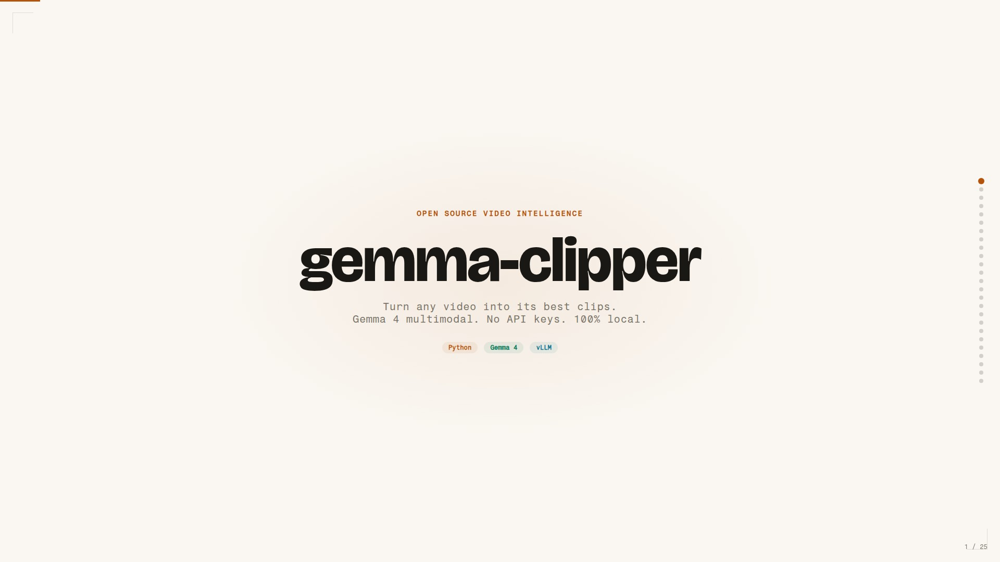
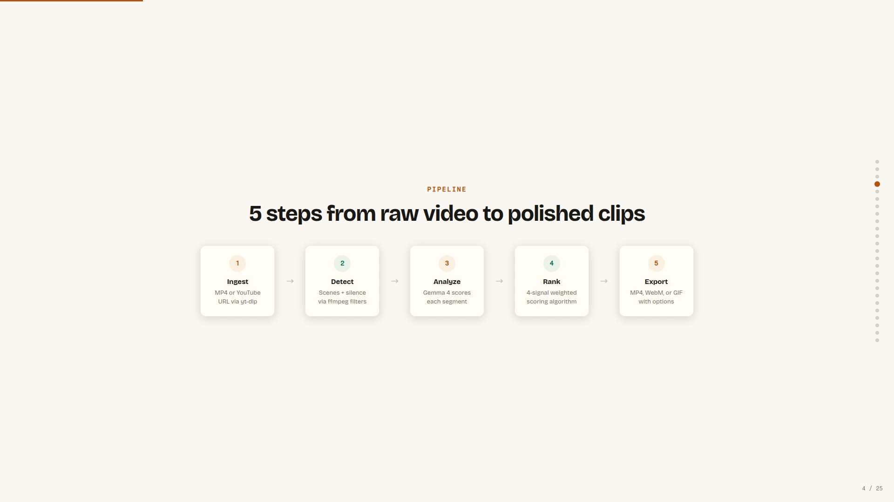
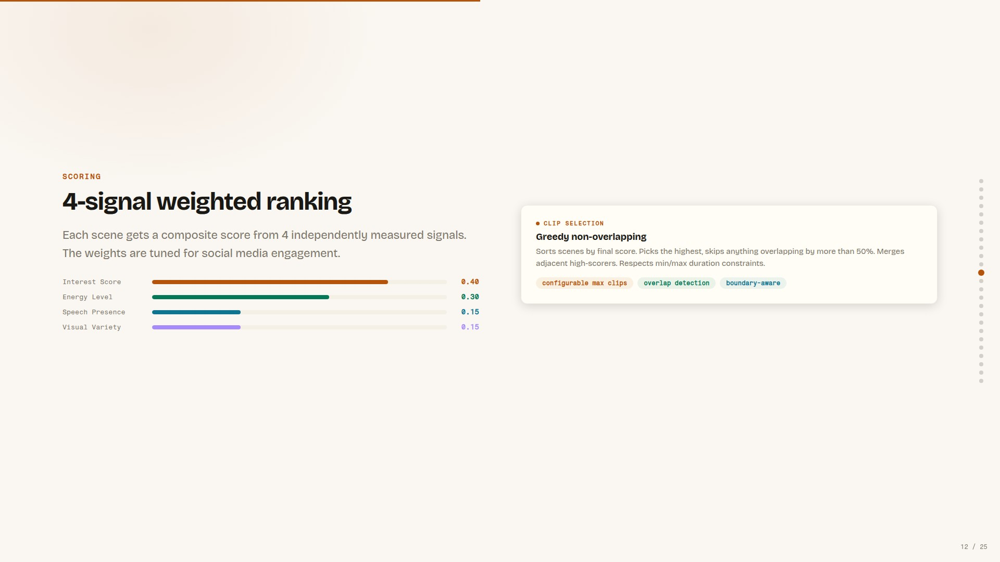
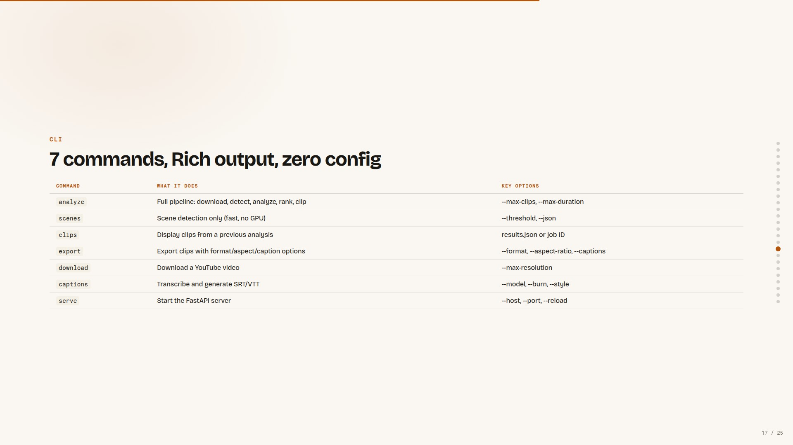
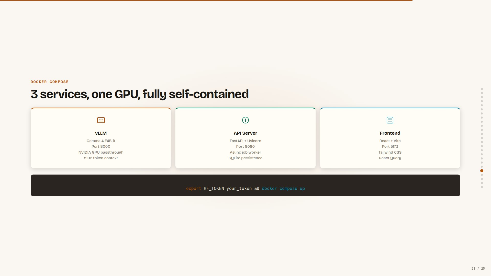
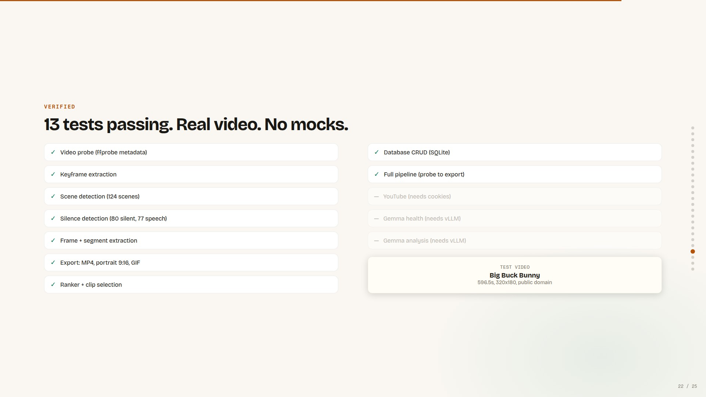

<p align="center">
  
</p>

<h1 align="center">gemma-clipper</h1>

<p align="center">
  <strong>AI-powered video clipping with Gemma 4. No API keys. 100% local.</strong>
</p>

<p align="center">
  
  
  
  
</p>

## Architecture at a Glance

<table>
  <tr>
    <td align="center"><strong>Pipeline Overview</strong><br></td>
    <td align="center"><strong>Ranking Algorithm</strong><br></td>
  </tr>
  <tr>
    <td align="center"><strong>CLI Commands</strong><br></td>
    <td align="center"><strong>Docker Architecture</strong><br></td>
  </tr>
  <tr>
    <td align="center"><strong>Test Results</strong><br></td>
    <td align="center"><strong>Full slide deck</strong><br><a href="https://jasperan.github.io/gemma-clipper/">Open the interactive 25-slide presentation</a></td>
  </tr>
</table>

## What it does

Turn any video into its best clips. Feed it an MP4 or YouTube URL, and Gemma 4 figures out which parts are worth keeping.

1. **Ingests** your video (local file or YouTube URL via yt-dlp)
2. **Detects scenes** using ffmpeg's scene-change filter
3. **Analyzes each segment** with Gemma 4 (4B multimodal, served locally via vLLM)
4. **Ranks scenes** by engagement: energy, speech content, visual variety, emotional peaks
5. **Exports clips** in your choice of format, aspect ratio, and quality

You get two things: a ranked list of every scene (so you can pick manually) and auto-selected "best moments" clips ready to ship.

## Features

- **Scene detection** with configurable sensitivity
- **AI-powered ranking** (Gemma 4 scores each segment for interest/engagement)
- **Auto-captions** via faster-whisper, with 3 burn-in styles (`default`/`bold`/`minimal`)
- **Short-form export** (9:16 center-crop for TikTok/Reels/Shorts)
- **Multiple output formats**: MP4, WebM, GIF
- Both a **CLI** and a **Web UI**

## Requirements

- Python 3.11+
- ffmpeg (system install)
- NVIDIA GPU with ~6GB VRAM (for Gemma 4 E4B-it via vLLM)
- For captions: faster-whisper pulls its own models automatically

## Quick start

### Option 1: Local install

```bash
uv sync --extra dev
```

Run commands with `uv run` (e.g. `uv run gemma-clipper analyze ...`), or activate the
environment with `source .venv/bin/activate` first.

Start vLLM serving Gemma 4 (in a separate terminal):

```bash
vllm serve google/gemma-4-E4B-it \
  --max-model-len 8192 \
  --gpu-memory-utilization 0.90 \
  --limit-mm-per-prompt '{"image":2,"video":1,"audio":1}' \
  --trust-remote-code
```

Then run:

```bash
# Analyze a YouTube video, auto-select 5 best clips
gemma-clipper analyze "https://www.youtube.com/watch?v=dQw4w9WgXcQ" --max-clips 5

# Just detect scenes (no AI, no GPU needed)
gemma-clipper scenes my_video.mp4

# Export clips as 9:16 vertical with captions
gemma-clipper export my_video.mp4 --aspect-ratio 9:16 --captions --caption-style bold

# Start the web UI
gemma-clipper serve
```

### Option 2: Docker Compose (recommended)

```bash
# Set your HuggingFace token for model downloads
export HF_TOKEN=your_token_here

docker compose up
```

This spins up 3 containers: vLLM (GPU), the API server, and the frontend. The web UI lands at `http://localhost:5173`.

<details>
<summary><strong>Advanced: run services individually</strong></summary>

```bash
# Start vLLM separately
docker compose up vllm

# Start API without Docker
GCLIPPER_VLLM_BASE_URL=http://localhost:8000/v1 gemma-clipper serve

# Start frontend dev server
cd frontend && npm install && npm run dev
```

</details>

## Architecture

```
src/gemma_clipper/
  core/       # ffmpeg wrappers: scene detection, silence detection, captions, export
  ai/         # Gemma 4 client, analysis pipeline, scene ranking
  api/        # FastAPI backend (10 endpoints + health check)
  workers/    # Async job processor
  cli.py      # 7 Typer commands with Rich output
  config.py   # All settings (env-configurable via GCLIPPER_ prefix)
  db.py       # SQLite for job/scene/clip persistence

frontend/     # React 18 + Vite + TypeScript + Tailwind CSS
```

## CLI commands

| Command | What it does |
|---------|-------------|
| `analyze` | Full pipeline: download, detect, analyze, rank, clip |
| `scenes` | Scene detection only (fast, no GPU) |
| `clips` | Display clips from a previous analysis |
| `export` | Export clips with format/aspect/caption options |
| `download` | Download a YouTube video |
| `captions` | Transcribe and generate SRT/VTT subtitles |
| `serve` | Start the FastAPI server |

## API endpoints

| Method | Path | Description |
|--------|------|-------------|
| POST | `/api/videos/upload` | Upload an MP4 file |
| POST | `/api/videos/youtube` | Submit a YouTube URL |
| GET | `/api/videos` | List all jobs |
| GET | `/api/videos/{id}` | Job detail with scenes + clips |
| DELETE | `/api/videos/{id}` | Delete a job |
| GET | `/api/clips/{job_id}` | Clips for a job (ranked) |
| POST | `/api/clips/{job_id}/export` | Export clips |
| GET | `/api/clips/{job_id}/scenes` | Ranked scene list |
| POST | `/api/clips/{job_id}/custom` | Create custom clip |
| GET | `/api/clips/download/{id}` | Download exported clip |

## Configuration

Everything's configurable via environment variables with the `GCLIPPER_` prefix:

```bash
GCLIPPER_VLLM_BASE_URL=http://localhost:8000/v1
GCLIPPER_GEMMA_MODEL=google/gemma-4-E4B-it
GCLIPPER_CHUNK_DURATION_SECONDS=30
GCLIPPER_SCENE_THRESHOLD=0.3
GCLIPPER_WHISPER_MODEL=base
GCLIPPER_DEFAULT_OUTPUT_FORMAT=mp4
GCLIPPER_DEFAULT_CRF=23
```

## How the ranking works

Each video segment gets scored on 4 signals, weighted and combined:

| Signal | Weight | Source |
|--------|--------|--------|
| Interest score | 0.4 | Gemma's assessment of engagement potential |
| Energy level | 0.3 | Gemma's assessment of visual/audio energy |
| Speech presence | 0.15 | Whether someone's talking (people watch talking) |
| Visual variety | 0.15 | Object/scene diversity within the segment |

The auto-clipper then greedily selects non-overlapping segments with the highest combined scores, respecting your min/max duration constraints.

## Inspired by

- [vibeframe](https://github.com/vericontext/vibeframe): CLI-first video editing with AI agents
- [overwatch](https://github.com/dwani-ai/overwatch): Gemma 4 multimodal video analysis pipeline

The key difference: gemma-clipper runs 100% locally. No OpenAI key, no Anthropic key, no cloud bill. Just your GPU and Gemma 4.

## License

MIT

<div align="center">
  
  
  
</div>
